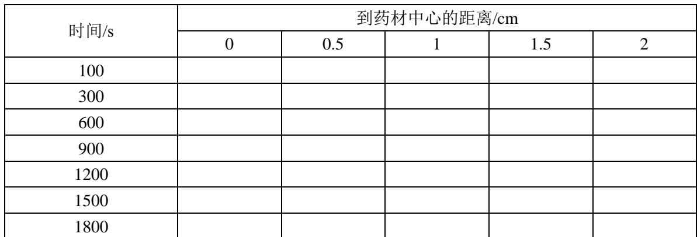
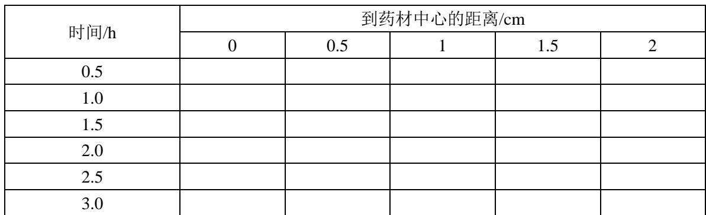
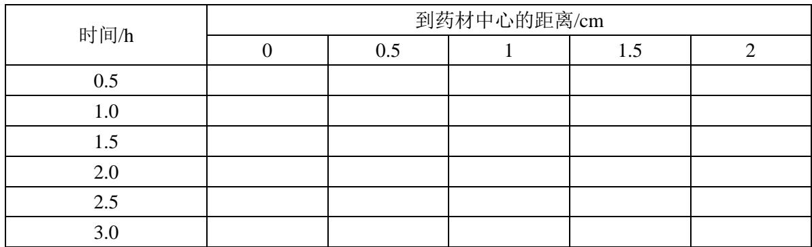
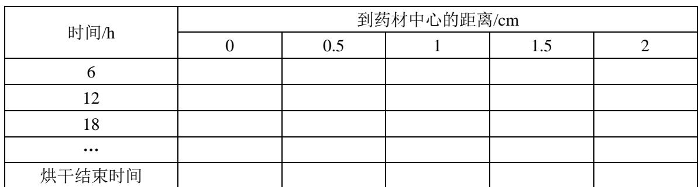
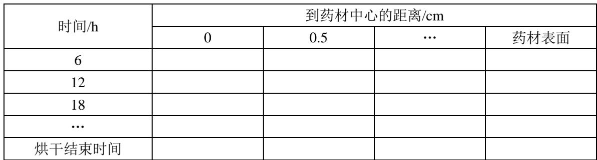
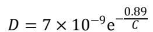
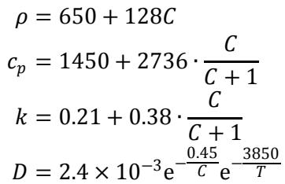
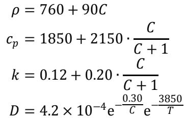

# A题 药材的烘干问题

干燥是决定中药材成品品质的关键工序之一，其中热风烘干是一种常见的干燥方式。该方式主要包括预热平衡和恒温干燥两个阶段，通过调控烘房温湿环境，完成药材的干燥。在中药材烘干过程中，工艺参数选取不当容易导致干燥效率低、能耗高、成品品质不稳定等问题。而传统的试验优化模式存在成本高、周期长等问题，亟需借助数理分析与数值仿真的方法得到干燥规律。

请建立数学模型解决以下问题。

**问题 1** 某中药材形状大致呈圆柱形，长为 25 cm，半径为 2 cm。烘干开始时，药材的温度为 28 ℃，水分浓度（即干基含水率）为 2.55 kg/kg，烘房的温度（单位：℃）和水分浓度（单位：kg/kg）的变化情况见附件 1。请建立预热平衡阶段药材温度和水分浓度变化规律的数学模型（相关参数见附录 2），在论文中按表 1 和表 2 的格式分别给出 100、300、600、900、1200、1500、1800 s，到药材中心距离 0、0.5、1、1.5、2 cm 处的结果，并将 1800 s 内每隔 1 s、到药材中心距离每隔 0.1 cm 的完整结果保存到文件 result1.xlsx 中（模板文件见附件 3）。所有结果保留四位小数（下同）。

表 1 30 分钟内药材的温度

| 时间/s | 到药材中心的距离/cm |  |  |  |  |
| --- | --- | --- | --- | --- | --- |
|  | 0 | 0.5 | 1 | 1.5 | 2 |
| 100 |  |  |  |  |  |
| 300 |  |  |  |  |  |
| 600 |  |  |  |  |  |
| 900 |  |  |  |  |  |
| 1200 |  |  |  |  |  |
| 1500 |  |  |  |  |  |
| 1800 |  |  |  |  |  |

表 2 30 分钟内药材的水分浓度

| 时间/s | 到药材中心的距离/cm |  |  |  |  |
| --- | --- | --- | --- | --- | --- |
|  | 0 | 0.5 | 1 | 1.5 | 2 |
| 100 |  |  |  |  |  |
| 300 |  |  |  |  |  |
| 600 |  |  |  |  |  |
| 900 |  |  |  |  |  |
| 1200 |  |  |  |  |  |
| 1500 |  |  |  |  |  |
| 1800 |  |  |  |  |  |

**问题 2** 烘干过程一般持续 2-3 天，预热平衡与恒温干燥阶段的参数有所不同。请建立整个烘干过程药材温度和水分浓度变化规律的数学模型（为简化问题，相关经验公式统一采用附录 3 中的公式），在论文中按表 3 和表 4 的格式分别给出 3 h 内每隔 0.5 h、到药材中心距离 0、0.5、1、1.5、2 cm 处的结果，并将每隔 1 s、到药材中心距离每隔 0.1 cm 的完整结果保存到文件 result2.xlsx 中（模板文件见附件 3）。

表 3 3 小时内药材的温度

| 时间/h | 到药材中心的距离/cm |  |  |  |  |
| --- | --- | --- | --- | --- | --- |
|  | 0 | 0.5 | 1 | 1.5 | 2 |
| 0.5 |  |  |  |  |  |
| 1.0 |  |  |  |  |  |
| 1.5 |  |  |  |  |  |
| 2.0 |  |  |  |  |  |
| 2.5 |  |  |  |  |  |
| 3.0 |  |  |  |  |  |

表 4 3 小时内药材的水分浓度

| 时间/h | 到药材中心的距离/cm |  |  |  |  |
| --- | --- | --- | --- | --- | --- |
|  | 0 | 0.5 | 1 | 1.5 | 2 |
| 0.5 |  |  |  |  |  |
| 1.0 |  |  |  |  |  |
| 1.5 |  |  |  |  |  |
| 2.0 |  |  |  |  |  |
| 2.5 |  |  |  |  |  |
| 3.0 |  |  |  |  |  |

**问题 3** 按照烘干要求，药材各处的水分浓度应低于 0.15 kg/kg，请确定药材烘干所需要的时间（单位：h）。在论文中按表 5 的格式给出每隔 6 h、到药材中心距离每隔 0.5 cm 的水分浓度，并将药材内部水分浓度每隔 60 s、到药材中心距离每隔 0.1 cm 的完整结果保存到文件 result3.xlsx 中（模板文件见附件 3）。

表 5 药材烘干过程的水分浓度

| 时间/h | 到药材中心的距离/cm |  |  |  |  |
| --- | --- | --- | --- | --- | --- |
|  | 0 | 0.5 | 1 | 1.5 | 2 |
| 6 |  |  |  |  |  |
| 12 |  |  |  |  |  |
| 18 |  |  |  |  |  |
| … |  |  |  |  |  |
| 烘干结束时间 |  |  |  |  |  |

**问题 4** 在实际烘干过程中，药材会因水分流失发生尺寸变化。请根据附件 2，确定药材的烘干时长（相关经验公式见附录 4）。在论文中按表 6 的格式给出每隔 6 h、到药材中心距离每隔 0.5 cm 的水分浓度，并将药材内部水分浓度每隔 60 s 时间、0.1 cm 距离的完整结果保存到文件 result4.xlsx 中（模板文件见附件 3）。

表 6 药材烘干过程的水分浓度

| 时间/h | 到药材中心的距离/cm |  |  |  |
| --- | --- | --- | --- | --- |
|  | 0 | 0.5 | … | 药材表面 |
| 6 |  |  |  |  |
| 12 |  |  |  |  |
| 18 |  |  |  |  |
| … |  |  |  |  |
| 烘干结束时间 |  |  |  |  |

## 附录 1 附件说明

附件 1 给出了烘干初期各时间点（单位：s）烘房的温度（单位：℃）和水分浓度（单位：kg/kg）。

附件 2 给出了烘干过程中各时间点（单位：s）药材的半径（单位：cm）。

附件 3 是结果文件夹，包括 4 个文件（result1.xlsx-result4.xlsx）。

result1.xlsx 问题 1 的结果模板文件

在“温度”和“水分浓度”工作表中分别保存问题 1 要求的温度（单位：℃）和水分浓度（单位：kg/kg），其中 A 列为时间（单位：s），第 1 行为到药材中心的距离（单位：cm）。

result2.xlsx 问题 2 的结果模板文件

在“温度”和“水分浓度”工作表中分别保存问题 2 要求的温度（单位：℃）和水分浓度（单位：kg/kg），其中 A 列为时间（单位：s），第 1 行为到药材中心的距离（单位：cm）。

result3.xlsx 问题 3 的结果模板文件

保存问题 3 要求的水分浓度（单位：kg/kg），其中 A 列为时间（单位：s），第 1 行为到药材中心的距离（单位：cm）。

result4.xlsx 问题 4 的结果模板文件

保存问题 4 要求的水分浓度（单位：kg/kg），其中 A 列为时间（单位：s），第 1 行为到药材中心的距离（单位：cm）。

## 附录 2 问题 1 的相关参数

密度为 $820 \, kg/m^{3}$、比热容为 $2600 \, J/(kg \cdot K)$、热传导系数为 $0.36 \, W/(m \cdot K)$，对流换热系数为 $25 \, W/(m^{2} \cdot K)$，对流传质系数为 $8 \times 10^{-7} \, m/s$，水分浓度扩散系数的经验公式为

$$
D = 7 \times 10^{-9} \mathrm{e}^{-\frac{0.89}{C}}
$$

其中 $D$ 为水分浓度扩散系数（单位：$m^{2}/s$），$C$ 为药材水分浓度（单位：kg/kg）。

## 附录 3 问题 2 和问题 3 的相关经验公式

问题 2 和问题 3 用到的经验公式

$$
\begin{array}{r l}
\rho &= 650 + 128C \\
c_{p} &= 1450 + 2736 \cdot \dfrac{C}{C+1} \\
k &= 0.21 + 0.38 \cdot \dfrac{C}{C+1} \\
D &= 2.4 \times 10^{-3} \mathrm{e}^{-\frac{0.45}{C}} \mathrm{e}^{-\frac{3850}{T}}
\end{array}
$$

其中 $\rho$ 为密度（单位：$kg/m^{3}$），$c_{p}$ 为比热容（单位：$J/(kg \cdot K)$），$k$ 为热传导系数（单位：$W/(m \cdot K)$），$D$ 为水分浓度扩散系数（单位：$m^{2}/s$），$C$ 为药材水分浓度（单位：kg/kg），$T$ 为药材温度（单位：K）。

## 附录 4 问题 4 的相关经验公式

问题 4 用到的经验公式

$$
\begin{array}{l}
\rho = 760 + 90C \\
c_{p} = 1850 + 2150 \cdot \dfrac{C}{C+1} \\
k = 0.12 + 0.20 \cdot \dfrac{C}{C+1} \\
D = 4.2 \times 10^{-4} \mathrm{e}^{-\frac{0.30}{C}} \mathrm{e}^{-\frac{3850}{T}}
\end{array}
$$

其中 $\rho$ 为密度（单位：$kg/m^{3}$），$c_{p}$ 为比热容（单位：$J/(kg \cdot K)$），$k$ 为热传导系数（单位：$W/(m \cdot K)$），$D$ 为水分浓度扩散系数（单位：$m^{2}/s$），$C$ 为药材水分浓度（单位：kg/kg），$T$ 为药材温度（单位：K）。

